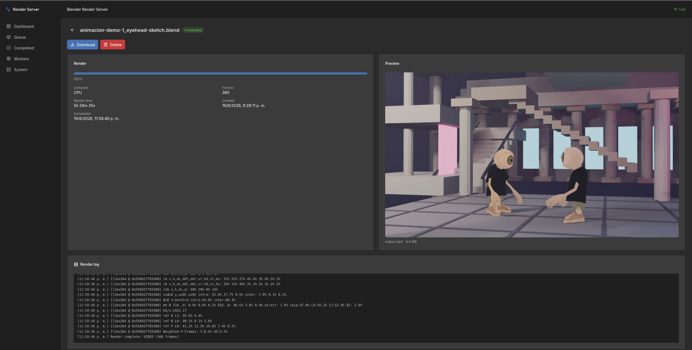

# Blender Render Server



Un servidor de renderizado autoalojado y de extremo a extremo para Blender. Sube un proyecto `.blend` o `.zip` a través de una interfaz web moderna, ponlo en cola, renderízalo sin interfaz gráfica en CPU o GPU NVIDIA, codifica animaciones a MP4 con FFmpeg, y previsualiza/descarga el resultado — todo detrás de un único origen Nginx.

## Funcionalidades

- Backend en **Fastify + TypeScript** con arquitectura modular y validación mediante JSON Schema
- Frontend en **React + Vite + shadcn/ui** con modo oscuro, actualizaciones en tiempo real y carga por drag & drop
- **SQLite** (vía Drizzle) como fuente de verdad para jobs, resultados, logs y workers
- **Redis + BullMQ** para la cola de renderizado (reintentos acotados, límites de concurrencia)
- Renderizado headless con **Blender** mediante una abstracción `RenderEngine` extensible
- Codificación de video con **FFmpeg**, con detección de FPS/resolución
- Tiempo real mediante **WebSocket** (`/api/ws`) para progreso, logs y eventos de workers
- **Nginx** como proxy inverso y único punto de entrada público (perfiles CPU y GPU NVIDIA)

## Arquitectura

```
                    Internet / LAN
                           │
                           ▼
                     ┌──────────┐
                     │  NGINX   │
                     │  :80     │
                     └────┬─────┘
                          │
             ┌────────────┴────────────┐
             │                         │
             │ /api/*                  │ /*
             ▼                         ▼
       ┌──────────┐              ┌──────────┐
       │ Fastify  │              │ Frontend │
       │ Backend  │              │ Static   │
       └────┬─────┘              └──────────┘
            │
       ┌────┴─────┐
       │          │
    SQLite      Redis
                  │
               BullMQ
                  │
                  ▼
             Render Worker
                  │
            ┌─────┴─────┐
            │           │
         Blender      FFmpeg
```

El navegador solo se comunica con Nginx. Fastify, Redis y el worker están aislados dentro de la red de Docker y nunca se exponen al host.

## Inicio rápido (CPU)

```bash
cp .env.example .env
docker compose up -d
```

Abre `http://SERVER_IP/` y sube un proyecto.

## GPU NVIDIA

1. Instala el driver de NVIDIA y el NVIDIA Container Toolkit:
   https://docs.nvidia.com/datacenter/cloud-native/container-toolkit/latest/install-guide.html
2. Levanta el stack con el overlay de GPU:

```bash
cp .env.example .env
docker compose -f docker-compose.yml -f docker-compose.gpu.yml up -d
```

El worker detecta sus capacidades de cómputo (`CPU`, `NVIDIA CUDA`, `NVIDIA OptiX`) y las reporta a la interfaz.

## Acceso

```text
http://SERVER_IP/
```

Todo se sirve bajo este único origen. No hay puertos separados para la API o el frontend — las peticiones a `/api/*` se enrutan hacia Fastify y el resto de rutas sirven la app de React.

## Persistencia

Todo el estado persistente vive bajo `/data`, montado como un volumen de Docker:

```text
/data
├── database/
│   └── app.db          # SQLite (jobs, resultados, logs, workers)
├── projects/
│   └── <job-id>/       # escena subida, assets, logs/render.log
└── renders/
    └── <job-id>/       # frames/ y output.mp4 / output.png
```

Para respaldar, toma una snapshot del volumen de Docker `render_data` (o apunta `DATA_DIR` a un bind mount). Los jobs y resultados sobreviven a `docker compose restart`.

## Configuración

Copia `.env.example` a `.env` y ajusta. Variables clave:

| Variable | Valor por defecto | Descripción |
| --- | --- | --- |
| `BACKEND_PORT` | `3000` | Puerto de Fastify (solo interno) |
| `DATABASE_URL` | `/data/database/app.db` | Ruta de SQLite |
| `REDIS_URL` | `redis://blender-redis:6379` | Conexión de Redis para BullMQ |
| `DATA_DIR` | `/data` | Raíz de datos persistentes |
| `BLENDER_PATH` | `/opt/blender/blender` | Ejecutable de Blender |
| `FFMPEG_PATH` | `/usr/bin/ffmpeg` | Ejecutable de FFmpeg |
| `MAX_UPLOAD_SIZE` | `10GB` | Tamaño máximo de subida |
| `MAX_CONCURRENT_RENDERS` | `1` | Renders concurrentes por worker |
| `DEFAULT_RENDER_MODE` | `CPU` | Modo de renderizado por defecto |
| `JOB_RETRY_ATTEMPTS` | `3` | Reintentos máximos por job |

## Desarrollo

Ejecuta solo Redis en Docker, y luego el backend, el worker y el frontend de forma nativa:

```bash
# 1. Levantar Redis
docker compose up -d blender-redis

# 2. Backend (Fastify en :3000)
npm install
npm run dev:backend

# 3. Worker
REDIS_URL=redis://localhost:6379 DATA_DIR=/data npm run dev:worker

# 4. Frontend (Vite en :5173)
npm run dev:frontend
```

### Red

**Desarrollo:**

```text
Navegador
  ↓
Vite :5173
  ↓ /api/* y /api/ws (proxy)
Fastify :3000
```

Vite redirige `/api` y `/api/ws` hacia el backend (ver `frontend/vite.config.ts`). El código de React siempre usa rutas relativas `/api/...` — nunca conoce el host o puerto del backend.

**Producción:**

```text
Navegador
  ↓
Nginx :80
  ├── /api/* → Fastify :3000
  └── /*     → Archivos estáticos de React
```

## API

Todas las rutas están bajo `/api`:

```text
POST   /api/uploads            subida multipart (.blend / .zip)
POST   /api/jobs               crear job a partir de una subida
GET    /api/jobs               listar jobs (filtrar por ?status=)
GET    /api/jobs/:id           detalle de un job
POST   /api/jobs/:id/cancel    cancelar un job en cola/activo
POST   /api/jobs/:id/retry     reintentar un job fallido/cancelado
GET    /api/jobs/:id/logs      logs de renderizado
GET    /api/jobs/:id/output    descargar/previsualizar resultado
DELETE /api/jobs/:id           eliminar job + archivos
GET    /api/workers            listado de workers
GET    /api/system/status      métricas de CPU/RAM/disco/GPU
GET    /api/health             liveness
GET    /api/ready              readiness (SQLite + Redis)
GET    /api/ws                 eventos en tiempo real por WebSocket
```

Eventos en tiempo real: `job.created`, `job.queued`, `job.started`, `job.progress`, `job.log`, `job.encoding`, `job.completed`, `job.failed`, `job.cancelled`, `worker.online`, `worker.offline`.

## Estructura del monorepo

```text
backend/          API en Fastify + Drizzle + productor de BullMQ
worker/           Consumidor de BullMQ + BlenderRenderEngine + FFmpeg
frontend/         React + Vite + shadcn/ui + TanStack Query
packages/shared/  tipos, enums, schemas y eventos compartidos
packages/db/      schema de Drizzle, migraciones, repositorios
docker/           Dockerfiles + configuraciones de nginx
```

## Pruebas

```bash
# Pruebas unitarias / de integración (SQLite en memoria, Redis/queue simulados)
npm run test -w @render-server/backend

# Prueba end-to-end (requiere Redis + Blender + FFmpeg + worker compilado)
npm run build -w @render-server/shared
npm run build -w @render-server/worker
npm run test:e2e -w @render-server/backend
```

La prueba e2e ejecuta un ciclo real de `subir → crear → encolar → renderizar → codificar → descargar` sobre una escena `.blend` generada de forma pequeña.

## Notas de seguridad

Autoalojado y privado por diseño, pero el código refuerza:

- sanitización de nombres de archivo y extracción segura de ZIP (protección contra path traversal, rutas absolutas y symlinks)
- límites de tamaño de subida y streaming (sin buffering en memoria de archivos grandes)
- invocación de subprocesos mediante arrays de argumentos (sin concatenación de strings en shell)
- acceso al sistema de archivos restringido a directorios por job bajo `/data`
- sin exposición directa de `/data`, Fastify, Redis o el worker

La autenticación queda intencionalmente fuera de alcance; el backend está estructurado para poder añadirla más adelante (todas las rutas son handlers delgados que delegan a servicios).
